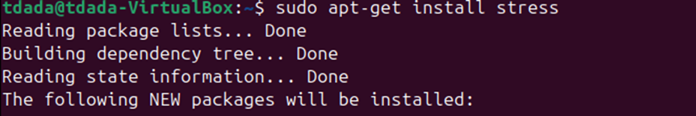
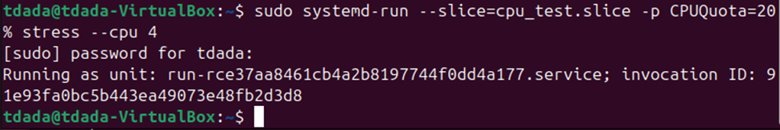
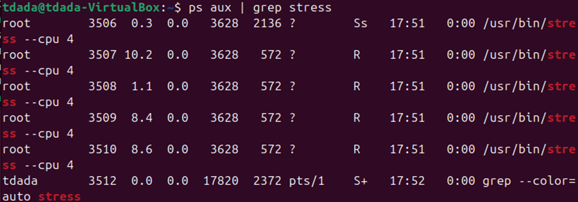
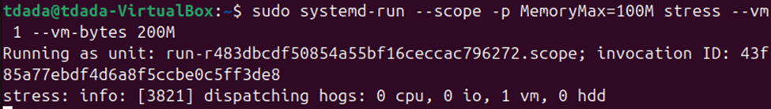
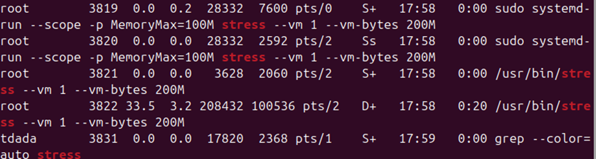
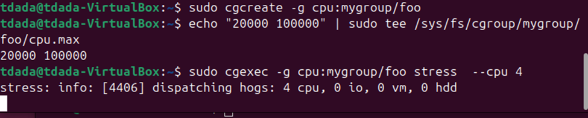
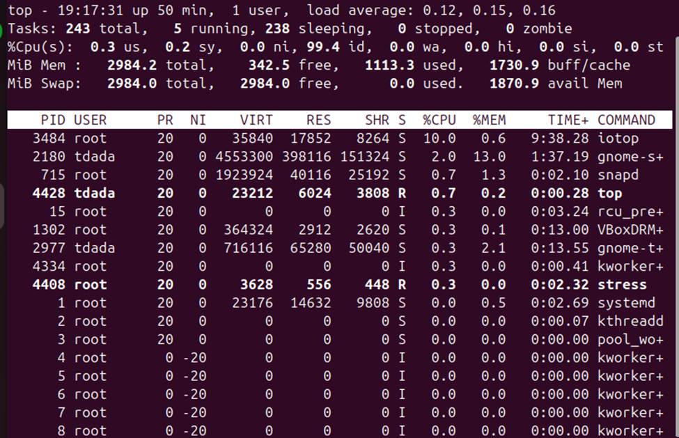
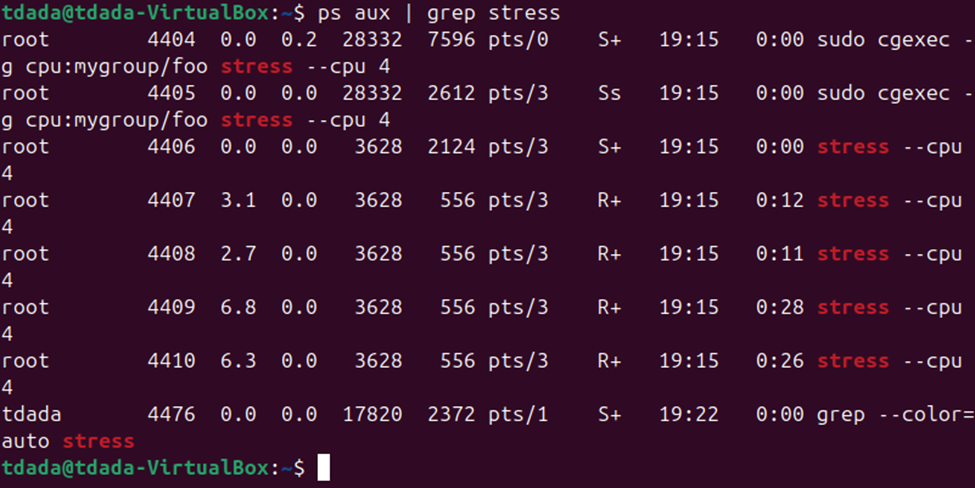
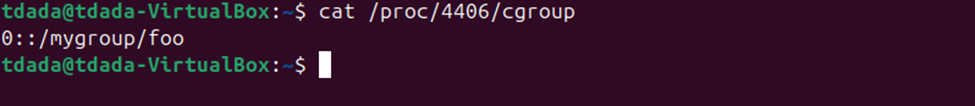

Title: Linux Containers Lab1 Report
Name: Temitope James Dada
Date: Spring (2026)
---

Explaination of the practical steps i performed and to understand Linux containers, control groups (cgroups), and resource limitation while using system tools. It consist of my observed outputs screenshots for the lab.

------------------------------------------------------------------------

## 1. Linux Containers

Linux containers are lightweight and isolated environments used to run applications. They rely on kernel features such as namespaces, cgroups, and chroot to ensure process isolation and efficient resource usage.


------------------------------------------------------------------------

## 2. Control Groups (Cgroups)

Cgroups are a Linux kernel feature that limit, measure, and control the resource usage of processes. They manage CPU, memory, I/O, and network bandwidth. Cgroups ensure each container gets only the resources assigned to it, enabling predictable performance and isolation.

------------------------------------------------------------------------

## 3. Using `systemd-run --slice`

A slice is a persistent grouping of system resources managed by systemd.

Command used:

``` bash
systemd-run --slice=cpu_test.slice --property=CPUQuota=20% stress
```
Below is my screenshot that shows a process (`stress`) running inside a custom slice
with a CPU limit of 20%, demonstrating CPU resource control. After installing the stress with `sudo apt-get install stress`



------------------------------------------------------------------------

## 4. Verifying Running Processes

Command used:

``` bash
ps aux | grep stress
```


The output that confirms that the `stress` process is actively running under the defined slice, validating successful execution.

------------------------------------------------------------------------

## 5. Memory Resource Limitation with systemd --scope

Command used:

``` bash
sudo systemd-run --scope -p MemoryMax=100M stress --vm 1 --vm-bytes 200M
```

In this test, the system attempts to allocate 200MB of memory while being restricted to a lower limit.



The image that shows that the process is constrained by memory limits, preventing it from exceeding allocated resources.

------------------------------------------------------------------------

## 6. Using `cgexec`
### What is cgexec
`cgexec` is a command‑line tool from the cgroup-tools package that allows you to run a program inside a manually created cgroup. Unlike systemd-run, which creates transient systemd units, cgexec directly attaches a process to a cgroup created under /sys/fs/cgroup. It is useful for testing resource limits without systemd.



The screenshot shows the process running within a custom cgroup, confirming manual resource control without systemd.

------------------------------------------------------------------------

## 7. Monitoring with `top`

Command used:

``` bash
top
```


The `top` output displays system processes in real time, showing the `stress` process and its resource consumption within the cgroup.



Below is the screenshot that proves that the process is running and its inside my custom cgroup which proves that the cgexec is running correctly 


------------------------------------------------------------------------
## Answers to theory questions

### *- Why aren’t the processes generated by stress following the cgroup constraint we set with our slice file?*

Because systemd-run --slice only places the service unit inside the slice, not the individual worker threads that stress forks after it starts. stress creates multiple child processes, and unless the slice has the correct controller enabled and the limit is applied at the slice level before the service starts, those child processes may run outside the constrained cgroup.

### *- Sentence or two describing the difference between --slice and --scope* 

--slice creates or uses a persistent cgroup slice managed by systemd. It is meant for grouping and applying resource policies to classes of workloads, and systemd may start a transient service unit inside that slice.

--scope creates a temporary cgroup for an already-running process. It does not create a service unit and does not persist. It is used to apply resource limits to interactive or ad‑hoc commands without systemd managing them as services.

## Conclusion

I was able to learn how Linux containers utilize cgroups for resource management. Tools like `systemd-run` and `cgexec` provide flexible ways to control CPU and memory usage, ensuring efficient and isolated process execution.


### Reference 
- Inbuilt `Man` resources 
- [Chapter 1. Introduction to Linux Containers | Overview of Containers in Red Hat Systems | Red Hat Enterprise Linux Atomic Host | 7 | Red Hat Documentation](https://docs.redhat.com/en/documentation/red_hat_enterprise_linux_atomic_host/7/html/overview_of_containers_in_red_hat_systems/introduction_to_linux_containers)
- https://www.kernel.org/doc/html/latest/admin-guide/cgroup-v2.html