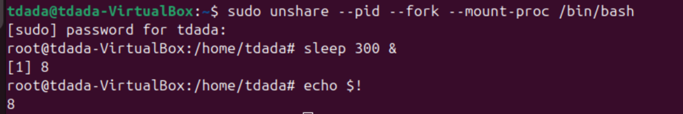
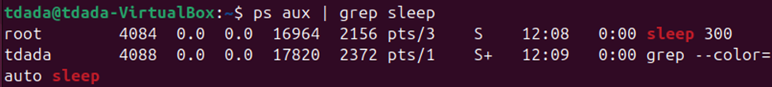
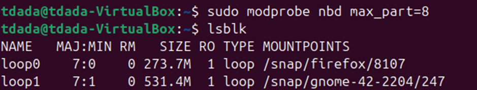
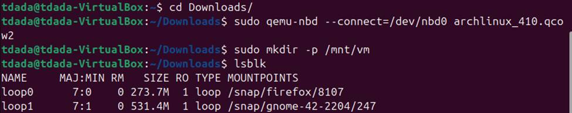
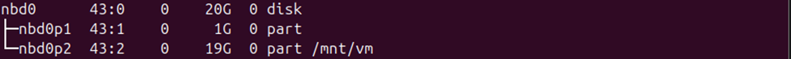
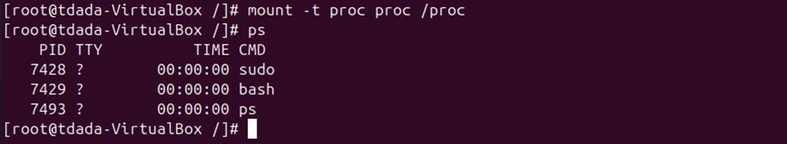
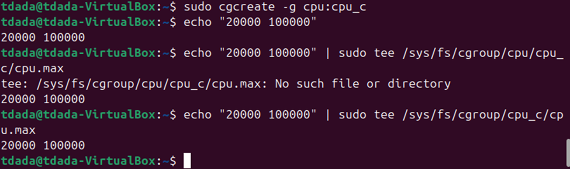
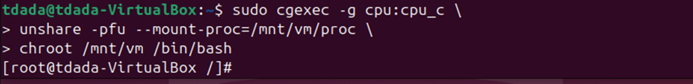
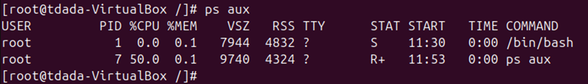
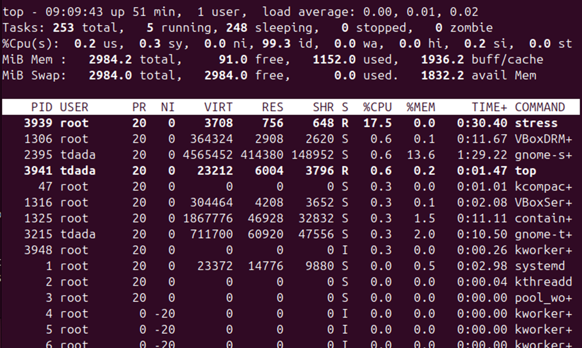

## Lab 1 part 2 - Build-a-Container
## Name: Temitope James Dada
### Task 1:
A namespace is a Linux kernel feature that wraps a global system resource so that processes inside the namespace see their own isolated instance of that resource. Processes outside the namespace see the global system state. They can be used in containerization(Docker, Kubernetes), and in sandboxes. 

### Task 2:
I created a namespace using unshare and demonstrated the active process in it.

### Task 3
I used the provided root file system from Lab1 and chroot into it.

The command failed because the system file that handles system processes is not present. The `/proc` file. ps reads process information from /proc, which is a virtual filesystem provided by the kernel. Inside the chroot, `/proc` was empty.

The command went through after mounting the system file. `/proc`

### Task 4
Combining everything together using Cgroup, Namespace, Chroot connecting to Qcow image.
I installed the cgroup-tools with `apt install cgroup-tools`

I created a CPU cgroup, then apply a CPU quota of 20% CPU to the process.

I used the correct path of where I mounted my qcow2 which is `mnt/vm`.That is the directory connected to my qcow2 image.

### Explanation for the code:
sudo cgexec -g cpu:cpu_c: runs the entire container inside the CPU‑limited cgroup.

unshare -pfu
Creates new namespaces:

-	-p → new PID namespace
-	-f → fork into the new namespace
-	-u → new UTS namespace lets me change the hostname
-	--mount-proc=/mnt/vm/proc: Mounts a new `/proc` inside the namespace so that only the container PIDs appear while host processes are hidden

chroot /mnt/rootfs /bin/bash: this switches the root filesystem to the qcow2 vm which is the container shell.

I cant see the processes from the host system because the processes that are visible are been limited with the namespace. PID 1 is now `/bin/bash,` not systemd.

I moved `stress` into the container in other to demonstrate the CPU-intensive task

I used `top` to confirm the CPU usage capped at ~20%, confirming cgroup enforcement

### Challenges and Resolutions
-	At first the ps wasn't working but was later solved by mounting the /proc inside the chroot
-	Was a little bit confused about mounting qcow2, but that was resolved in understanding nbd + qemu-nbd 

### References 
This is a combination of all we did in week 1 and 2