# Password Recovery Using chroot and VM Repair
## Name: Temitope James Dada.

This report explains the step-by-step process of recovering a forgotten password in a virtual machine (VM). The workflow involves mounting the VM disk, accessing it using a chroot environment, modifying system credentials, and verifying the recovery by booting the VM.

------------------------------------------------------------------------

## 1. Connecting the Virtual Disk

The process begins by attaching the `.qcow2` virtual disk to the host system using `qemu-nbd`. The command enables the system to treat the VM disk as a physical drive. This allows access to its partitions through `/dev/nbd0`.

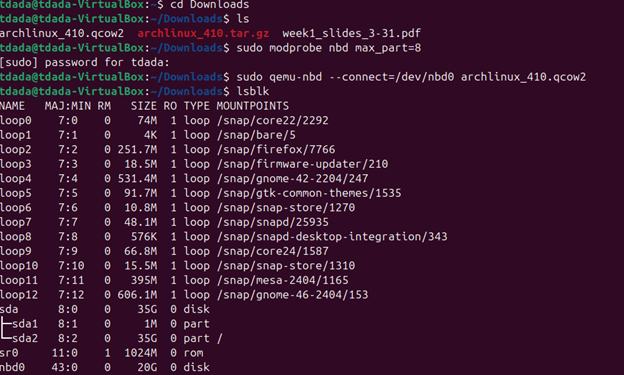
------------------------------------------------------------------------

## 2. Troubleshooting Disk Mount Issues

Initially, the disk appeared mounted but partitions were not visible. This indicated an extraction issue. After re-extracting the disk file, the partitions became visible, confirming correct disk structure.

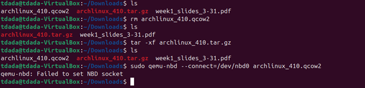
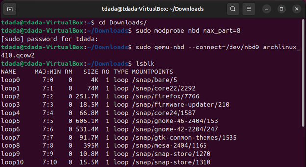
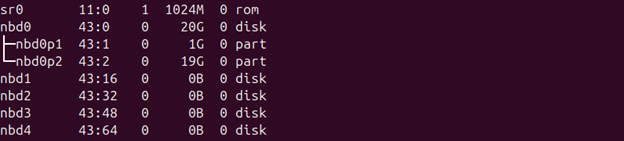
------------------------------------------------------------------------

## 3. Mounting the Root Filesystem

The VM's root filesystem was mounted to `/mnt/vm`. This step is critical as it provides direct access to the VM's internal files, enabling administrative operations such as password reset.

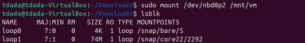
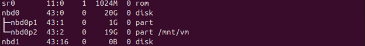
------------------------------------------------------------------------

## 4. Entering the chroot Environment

Using `chroot`, the mounted filesystem was accessed as if it were the running system. This allowed execution of system-level commands within the VM environment, including resetting the user password.

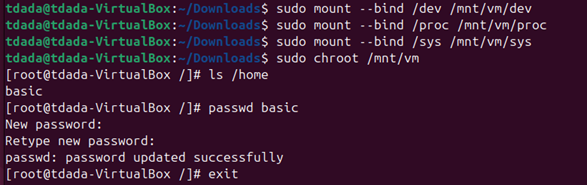
------------------------------------------------------------------------

## 5. Password Reset

Within the chroot environment, the password for the existing user was successfully updated. This step restores access to the VM without needing the original credentials.

------------------------------------------------------------------------

## 6. Cleanup Process

After completing the modifications, the filesystem was safely unmounted. Proper cleanup ensures no data corruption occurs and releases system resources.

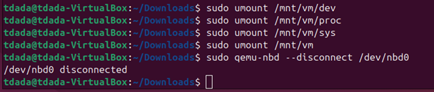
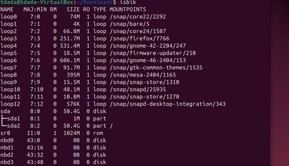
------------------------------------------------------------------------

## 7. Disk Format Conversion

The VM disk was converted from `.qcow2` format to `.vdi` and `.vmdk` using `qemu-img`. This conversion allows compatibility with virtualization platforms like VirtualBox that i used.

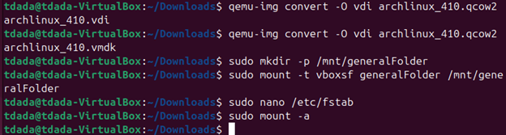
------------------------------------------------------------------------

## 8. File Transfer and Organization

The converted files were placed into a shared folder (`generalFolder`) and transferred to the host system for further use and testing.

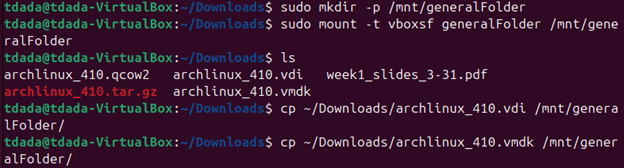
------------------------------------------------------------------------

## 9. File Integrity Verification

Hash values were generated on both the source and destination systems to verify file integrity. Matching hashes confirmed that the transfer was successful and files were not corrupted.

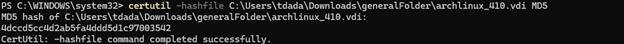
------------------------------------------------------------------------

## 10. Verification by Booting the VM

Finally, the VM was booted using the converted `.vdi` file. Successful login confirmed that the password recovery process was completed correctly.

------------------------------------------------------------------------

## Challenges and Conclusion

This process demonstrates a reliable method for recovering VM access by leveraging disk mounting, chroot environments, and virtualization tools. Each step ensures system integrity while restoring access efficiently. 

I extracted the archived file using File Explorer, which probably corrupted the file, preventing it from displaying the partitions. Later, I extracted it again using a Linux command instead.
