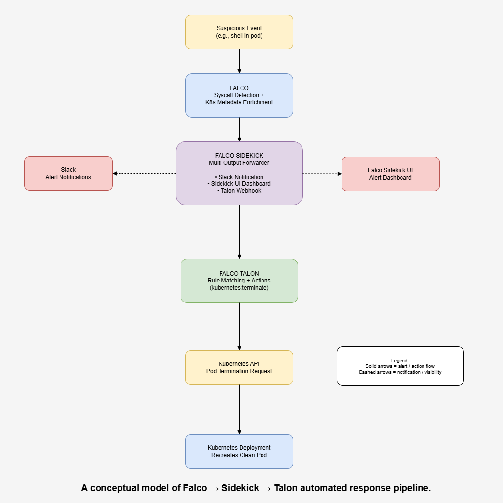

## Temitope James Dada
### Tell me what you did to prepare your server

I performed a stress testing on our server with nmap, to check for open ports and any known vulnerability. Right now our major ports are closed and we dont have a vulnerable system.

- Make sure you have what you need to examine logs.

We have logs for activities within our system. This can ba inspected to detect any packet rush, scanning or any external intrusion.

- If you have nothing to prepare for, tell me about another type of
defense you could implement and how it would help.

I started working on implementing another layer of security to our system and i came up with Falco, an intrusion detection tool that works at the sys-call level. It was used to monitor our pods for any abnormal behaviour or intrusion within the kubernetes system. Falco sends the alert to falco sidekick and sidekick serves as a central station that sends the alert to three outlets.

The alerts are sent simultaneously to Slack for real time notification, then to falco sidekick UI alert dashboard where the alert and threats can be visualised, also to Falco Talon where an action can be taken on the alert based on specified rules. Falco talon terminates such a compromised pods and Kubernetes deployment recreates a clean pod again. This affects any attack attempt and the services are still intact. 

Tell me what your group needs to finish for your lab 8.
• I need to know what you are working on and what you group members are working on.

- We are currently working on getting our system more fortified and also completing our paper work. 

i am working on:
 - completing the Falco Talon implementation.
 - integrating it into our system and paper work
 - Writting the result and conclusion section of our paper. 

