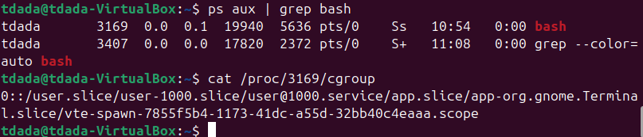

## Week 2 more containers primitives
## Name: Temitope James D.

### What are some differences between cgroups versions 1 and 2?
| Feature | cgroups v1 | cgroups v2 |
|---------|------------|------------|
| Hierarchy | Multiple independent hierarchies | Single unified hierarchy |
| Controller behavior | Each controller can be mounted separately | All controllers live in one tree |
| Process assignment | A process can be in different cgroups for different controllers | A process lives in exactly one cgroup |
| Interface | Many files, inconsistent naming | Unified, consistent interface |
| I/O control | blkio controller | io controller (completely redesigned) |

### Where can I find what group a process is a part of?

Every process has a file and this can be checked in the following way, using bash process as an example

You can check the PID with `ps aux | grep bash`
then use `/proc/PID/cgroup` to know the group its part of

### Where can I see what is limited in a particular control group?
This can be found by inspecting the cgroup directory itself

By using using /sys/fs/cgroup/<path-from-cgroup-file>/, with that you can inspect limits for `cat cpu.max` `cat io.max` and so on.

### Locate resources for the two control group versions, specifically what the different group attributes are.

- Documentation for cgroups v2
   - Linux kernel documentation (official)
  Unified cgroup hierarchy (v2)  
https://www.kernel.org/doc/html/latest/admin-guide/cgroup-v2.html

   - Man pages
    man 7 cgroups  
https://man7.org/linux/man-pages/man7/cgroups.7.html

    man 7 cgroup_namespaces  
https://man7.org/linux/man-pages/man7/cgroup_namespaces.7.html

- Documentation for cgroups v1
   - Kernel docs
Legacy cgroups v1  
https://www.kernel.org/doc/Documentation/cgroup-v1/ 

   - Man pages
   - man 7 cgroups (covers both v1 and v2)
https://man7.org/linux/man-pages/man7/cgroups.7.html

### References 
- CPU controller:
https://www.kernel.org/doc/html/latest/admin-guide/cgroup-v2.html#cpu

- Memory controller:
https://www.kernel.org/doc/html/latest/admin-guide/cgroup-v2.html#memory

- I/O controller:
https://www.kernel.org/doc/html/latest/admin-guide/cgroup-v2.html#io