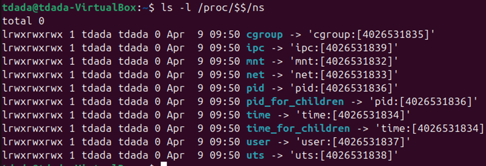
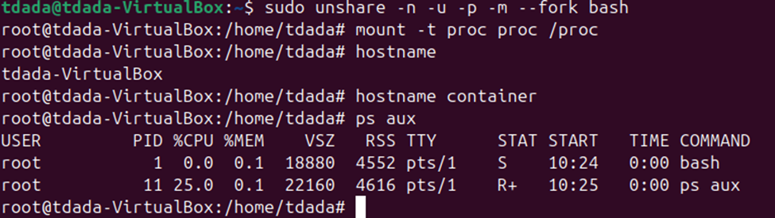
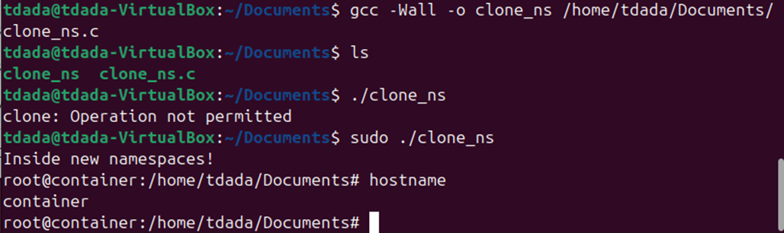

## Linux Namespaces
## Name: Temitope James Dada

Namespaces are a Linux kernel feature that provides isolation by giving processes their own separate view of global system resources. The processes inside the namespace see their own isolated instance of that resource while processes outside the namespace see the global system state.
### Types of namespaces:
- PID – isolates process IDs
- Mount – isolates filesystem mount points
- Network – isolates network interfaces and routing
- UTS – isolates hostname/domain name
- IPC – isolates inter‑process communication
- User – isolates user/group IDs

### Where do I find the namespaces associated with a PID?
Every process has a directory, so by typing `/proc/<pid>/ns/` you’d see the symlinks for each namespace type


###  How do I read the value of the files in that directory?
Each entry is a symbolic link, we can use `ls -l` to read the values of the files in that directory


### What program from the command line can I use to move a process to a namespace?
The canonical tool is:

`nsenter`
`nsenter` uses the `setns(2)` system call to join an existing namespace.
`sudo nsenter --target <pid> --net --uts --ipc --pid` This moves the shell into the target process namespaces.

### To use unshare to create new namespaces 
`sudo unshare -n -u -p -m --fork bash`
Then mount the /proc file inside the namespace 
`mount -t proc proc /proc`

I created: a new network namespace (-n)
a new UTS namespace (-u)
a new PID namespace (-p)
a new mount namespace (-m)
and forked a child to become PID 1 (--fork)
Then i mounted the /proc file



I created a .c program that uses clone() to create a new namespace. A copy of the code is beneath the output image.



```
#define _GNU_SOURCE
#include <sched.h>
#include <stdio.h>
#include <stdlib.h>
#include <unistd.h>
#include <sys/wait.h>

#define STACK_SIZE (1024 * 1024)

static int child_fn(void *arg) {
    printf("Inside new namespaces!\n");

    // Change hostname (UTS namespace)
    sethostname("container", 9);

    // Execute a shell
    execlp("/bin/bash", "bash", NULL);
    perror("execlp");
    return 1;
}

int main() {
    char *stack = malloc(STACK_SIZE);
    if (!stack) {
        perror("malloc");
        exit(1);
    }

    char *stack_top = stack + STACK_SIZE;

    int flags = CLONE_NEWUTS | CLONE_NEWPID | CLONE_NEWNS | SIGCHLD;

    pid_t pid = clone(child_fn, stack_top, flags, NULL);
    if (pid == -1) {
        perror("clone");
        exit(1);
    }

    waitpid(pid, NULL, 0);
    free(stack);
    return 0;
}

```

### References 
- `man` for my namespaces overview, clone, setns, unshare
- Ubuntu Manpage: namespaces - overview of Linux namespaces
- namespaces(7) — manpages — Debian buster — Debian Manpages


