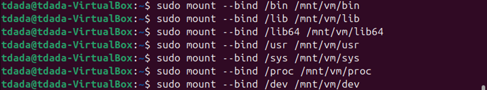
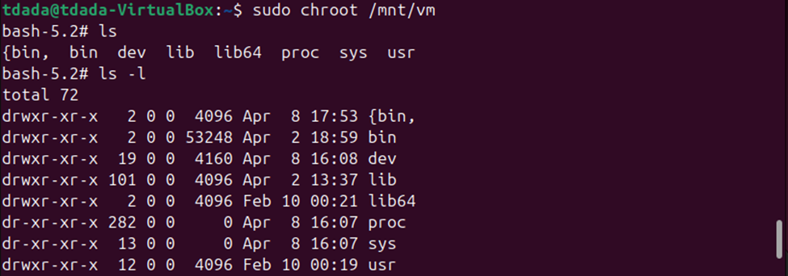
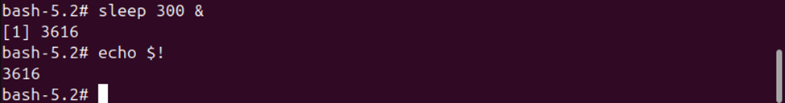
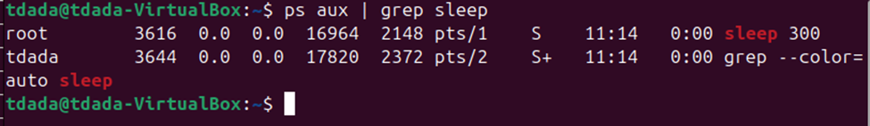
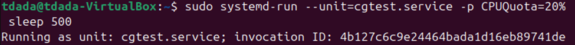
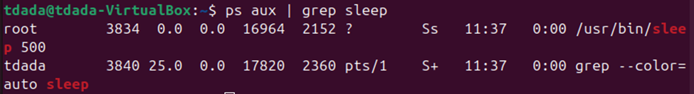
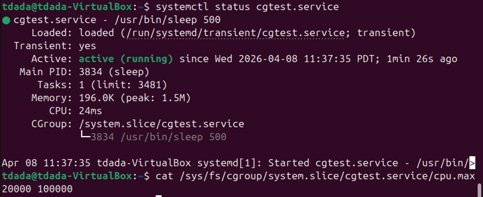

# Report Title: Linux Container Isolation Methodology
# Name: Temitope James DADA

A Linux container is a lightweight, isolated environment designed to run applications by leveraging kernel features such as **chroot**, **cgroups**, and **namespaces** 

---

## 1. Filesystem Isolation with (chroot)
A target root directory was created with `sudo mkdir -p /mnt/vm`.

* **Mounting System Files**
- To create an isolated root filesystem, essential host directories (`/bin`, `/lib`, `/proc`, `/sys`, `dev`) are mounted into a target directory `/mnt/vm` using `mount --bind` 

- This provides the isolated environment with the necessary binaries and libraries to function
  

---
* **Entering the Chroot**
- By running sudo chroot /mnt/vm, the process’s root directory is changed, effectively "locking" it into the new path.

- A directory listing (ls -l) within this environment confirms that only the mounted system files are visible as the root structure.

---
* **Process Visibility in Chroot**
- Running a sleep 300 process inside the chroot assigned it a PID of 3616.
  

- Checking from the host terminal with ps aux | grep sleep showed the process was still fully visible to the host.
  

Chroot only isolates the filesystem; it does not provide process (PID) isolation

## 2. Resource Control with Control Groups (cgroups)
Control Groups (cgroups) manage and limit hardware resources allocated to processes.

* **Creating a CPU-Limited Cgroup**
- A cgroup was created using systemd-run with a defined CPUQuota=20% for a sleep 500 process.

* **Verifying Resource Limits**
- The status of the service was verified via systemctl status cgtest.service, confirming it was active and governed by the specified slice.

- The filesystem path `/sys/fs/cgroup/system.slice/cgtest.service/cpu.max` was checked to confirm the quota of 20000 (20%) was correctly applied.

Cgroups effectively limit resource consumption, but like chroot, they do not hide processes from the host’s global view

---

## 3. Process Isolation with Namespaces
Namespaces are the primary mechanism for isolating a process's view of the system, such as its own PID tree.

* **Creating a PID Namespace**
- Using the unshare `--pid --fork --mount-proc` command, a new shell was launched in a private PID namespace.
  

Inside this namespace, a sleep 300 process was assigned PID 8.

* **Host View and Container View**
- While the process thought it was PID 8 inside the namespace, the host viewed the same process as PID 4084.

Namespaces change the view from the inside, providing the illusion of a standalone system, but the host maintains a global perspective

---

## Questions on Host Visibility
Are container processes visible to the host? **Yes**. Because the host operates in the initial, global namespace, it maintains visibility over:
* All PIDs and processes
* All cgroups and resource limits
* All chrooted environments 

Ultimately, containers only change the perspective from **inside** the environment; they do not obscure the host’s global view.
