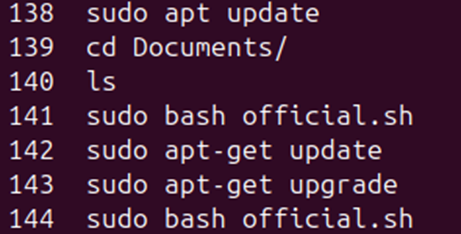
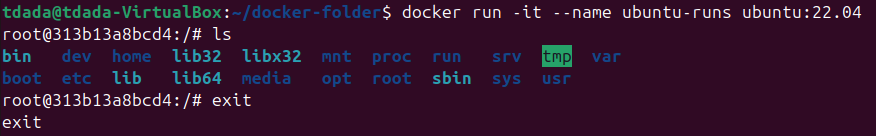
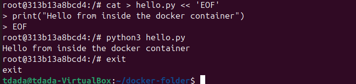
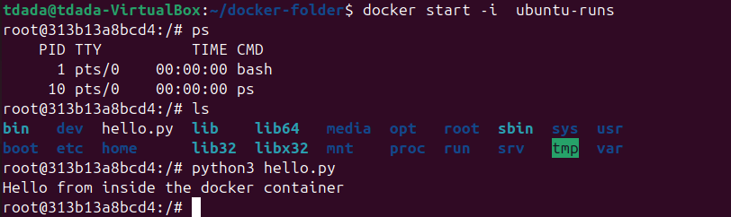

## Name: Temitope James Dada

### Install docker(link for those with Ubuntu).

[Install Docker Engine on Ubuntu](https://docs.docker.com/engine/install/ubuntu/)

I saved the installation instruction in a .sh file format so that i can run all the instructions in a shell terminal. 

### Add yourself to the docker group, Why would I have you do this?

I added the current user to the docker group with `sudo usermod -aG docker $USER`. This is important because the docker daemon always runs as the root user. By default it communicates through a Unix socket owned by root, which makes other users to need sudo to access it. So adding myself to the group grants me the permission to talk to the socket directly.

### Pull a docker container from docker hub.

This is done by running `docker pull IMAGE NAME` e.g `docker pull python`

### Run the container in an interactive shell (docker run -it
CONATAINER_NAME).

### Start up the container again. ### Make a small python program in the container (maybe a “hello world”). ### Run it. ### Exit the container.

### Start the same container image. ### Is the program still there.

Yes it is.

