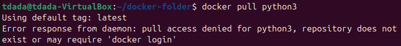

## Week 3 real containers
## Name: Temitope James Dada

### Task/Questions 

**What is a hypervisor?**
A hypervisor is specialized virtualization software that allows multiple full operating systems to run on a single physical machine. It creates and manages virtual machines (VMs), each with its own virtual CPU, memory, storage, and virtualized hardware. Because each VM includes its own complete kernel, the hypervisor must emulate or pass through hardware resources so every guest OS believes it is running on its own computer.

**Do containers use them? and Why**
Containers do not use hypervisors, because containers are not virtual machines. Instead of virtualizing hardware and running separate kernels, containers share the host’s Linux kernel and isolate processes using kernel features such as namespaces, cgroups, and chroot. 

Containers don’t need a hypervisor because they don’t emulate hardware or run their own kernel; they rely on the host kernel for system calls, scheduling, and resource management. 

**Pull different docker containers.**
Docker containers can be pulled using the `docker pull` command followed by the image name. Each of these commands downloads a different root filesystem and environment from Docker Hub. 

**What is different about the containers you pulled?**

Each container image represents a different Linux distribution or application environment.

Ubuntu containers include the apt package manager, a larger base filesystem, and more preinstalled utilities, making them suitable for general-purpose workloads.

But python comes with specific applications preinstalled, that is they are designed for running servers or development environments immediately. 

**Can you install packages in the container?**

Yes, you can install packages inside a running container using the distribution’s package manager (e.g., apt install, apk add, yum install). 

- – Is it persistent across boots? 
  No, changes inside a container are not persistent across boots unless you explicitly save them. Docker encourages immutable infrastructure, meaning you should rebuild containers from Dockerfiles rather than modifying them manually.
**Can you run more than one the same container?**
Yes, Docker allows you to run multiple instances of the same image simultaneously. Each container is an isolated process with its own filesystem, network namespace, and resource limits.

**What environment would this be useful in?**
Running multiple containers is useful in environments that require scalability, isolation, and reproducibility. In development, containers allow developers to test different versions of software without affecting the host system.

**“docker cheat sheet”markdown file**.

