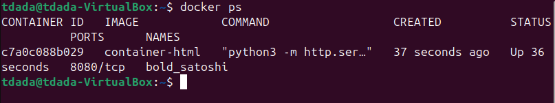
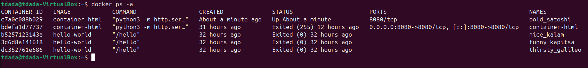

## Real containers (Dockerfile)
## Name: Temitope James D.

### How to list docker containers that are running.

`docker ps`

### How to list all docker containers (running or not).

`docker ps -a` Displays every container on the system, including exited ones.

### How to delete a docker container.

`docker rm CONTAINER_ID` docker container can be deleted by container ID or name

### How to delete a docker image.

`docker rmi IMAGE_ID`
**docker:** The main command for the Docker engine.
**rmi:** Short for "Remove Image."
**IMAGE_ID:** The unique fingerprint of the image you want to delete (you can find this by running docker images).

### How to start a docker container in the background (i.e., “detached”).

`docker run -d IMAGE_NAME`

### How to get a shell in a docker container currently in the background.

`docker exec -it CONTAINER_ID /bin/bash`
**-i (interactive):** Keeps STDIN open even if not attached.
**-t (tty):** Allocates a pseudo-terminal (makes it look like a real terminal).
**/bin/bash:** This is the shell you want to open.

if the container uses Alpine or BusyBox:
`docker exec -it CONTAINER_ID /bin/sh`

### How to make a port available to the host (i.e., make a container port accessible to/from the host).

`docker run -d -p 8080:80 IMAGE_NAME`
This means port 80 inside the container becomes available on localhost:8080 on the host.