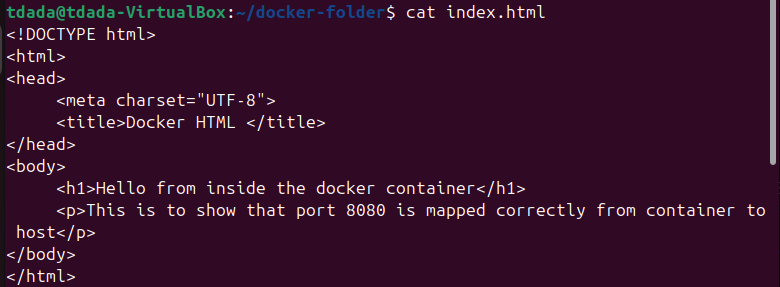
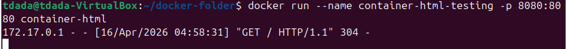
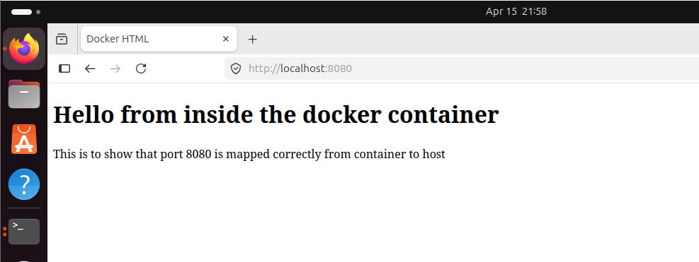

## Real containers (Dockerfile)
## Name: Temitope James D.

```
mkdir ~/docker-folder
cd ~/docker-folder

```
`mkdir ~/docker-folder` `cd ~/docker-folder` : i created a new folder in my home directory to keep everything for this lab in one place, then move into the directory.

```
cat > index.html << 'EOF'
<!DOCTYPE html>
<html>
<head>
     <meta charset="UTF-8">
     <title>Docker HTML </title>
</head>
<body>
     <h1>Hello from inside the docker container</h1>
     <p>This is to show that port 8080 is mapped correctly from container to host</p>
</body>
</html>

EOF

```
`cat > index.html << 'EOF'` this starts the file and everything typed afterwards are written in the `index.html`



**Create a docker file that will:**
**– Pull a Linux distribution (Ubuntu, apline, arch, etc.).**
**– Install a package not there by default.**
**– Put a file into the container that is on the base system.**
**– Run a program upon starting the container.**

```
cat > Dockerfile << 'EOF'
_Use official Ubuntu as the base image_
FROM ubuntu:22.04

_Set a working directory inside the container_
WORKDIR /app

_Install python3 (package not present by default in minimal images)_
RUN apt-get update && \
    apt-get install -y python3 && \
    rm -rf /var/lib/apt/lists/*

_Copy the HTML file from the host into the container_
COPY index.html /app/index.html

_Expose port 8080 inside the container_
EXPOSE 8080

_Run a simple HTTP server on port 8080 when the container starts_
CMD ["python3", "-m", "http.server", "8080"]
EOF

```
`docker build . -t container-html`
- `docker build .` tells Docker to build an image using the `Dockerfile` in the current directory (. is the build context).
- `-t container-html` tags the image with the name `container-html` so that it can be refered to easily later.

The Docker will:
- Pull ubuntu:22.04 if needed.
- Run the RUN step to install python3.
- Copy index.html.
- Register EXPOSE 8080 and CMD.

### Run a container and map port 8080 to the host 
`docker run --name container-html-testing -p 8080:8080 container-html`

- `-p 8080:8080` publishes the container’s port 8080 to the host’s port 8080:
  - Left side (8080) = host port.
  - Right side (8080) = container port 


### Test from the host
`http://localhost:8080`



