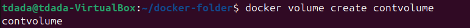

## Name: Temitope James Dada

### Add a volume (or bind mount) to your docker container.

A volume or bind mount can be added to a container using the -v or --mount flag. It is managed by docker and stored under /var/lib/docker/volumes, while a bind mount maps a directory from the host filesystem directly into the container.

`docker run -v /host/path:/container/path IMAGE`

That is anything written inside /container/path appears on the /host/path. Volumes are created and managed by Docker itself, while bind mounts rely on existing host directories. Both methods allow data to persist outside the container’s ephemeral filesystem.
**Answer the questions:**
### How do I add persistent storage to a docker container?

Persistent storage is added by mounting either a Docker volume or a bind mount. it can be created with `docker volume create mydata` and used with `docker run -v mydata:/data IMAGE` 

### What is the difference between a volume and bind mount?
A bind mount directly maps a host directory into the container. it gives the container access to the exact files on the host machine, which is useful for development, debugging, or sharing source code. However, bind mounts depend on the host’s directory structure and permissions, making them less portable. 

A volume, on the other hand, is fully managed by Docker. Docker decides where the data lives, handles permissions, and ensures portability across systems. Volumes are better for production because they are isolated from the host filesystem and easier to back up, migrate, and secure.

### Can I mount it such that the container can only read from the disk?
∗ If so, how?
• In no less than a paragraph write about:

Yes, Docker allows read‑only mounts using the :ro option. This prevents the container from modifying the mounted directory or volume

`docker run -v /host/path:/container/path:ro IMAGE`

This is useful when you want the container to access configuration files, static assets, or datasets without risking accidental modification. 

### How you could emulate docker from your lab 2 assignment.
– Include how you would:

After combining the primitives(namespaces, cgroups and chroot) mount the root file system unshare into new namespaces, mount `/proc` then you would have to _run an init process inside the isolated environment_

### Make different containers of different Linux distributions (e.g., Ubuntu, alpine, python…).

you can pull any of the available images into your directory. `docker pull ubuntu`, `docker pull python`  will pull the images and gives different root filesystems layered on top of each other

### Make more than 1 of the same container run simultaneously.

`docker run ubuntu` creates a new isolated process tree, so running `docker run python` will not prevent or hinders anything. Both can running simultaneously.

### Have work done in the container not be persistent.

Docker achieves non‑persistence by giving each container a temporary writable layer that disappears when the container is removed, unless you commit the container or use a volume, all changes are ephemeral.

### Anything else you’ve noticed docker does.

- Docker’s networking stack creates virtual interfaces, bridges, and NAT rules so containers can communicate with each other or the outside world. Port mapping (-p 8080:80) allows services inside containers to be accessible from the host.
- Docker images use layered filesystems, which save space and make updates efficient. 
- Dockerfiles allow reproducible builds, ensuring that environments can be recreated exactly