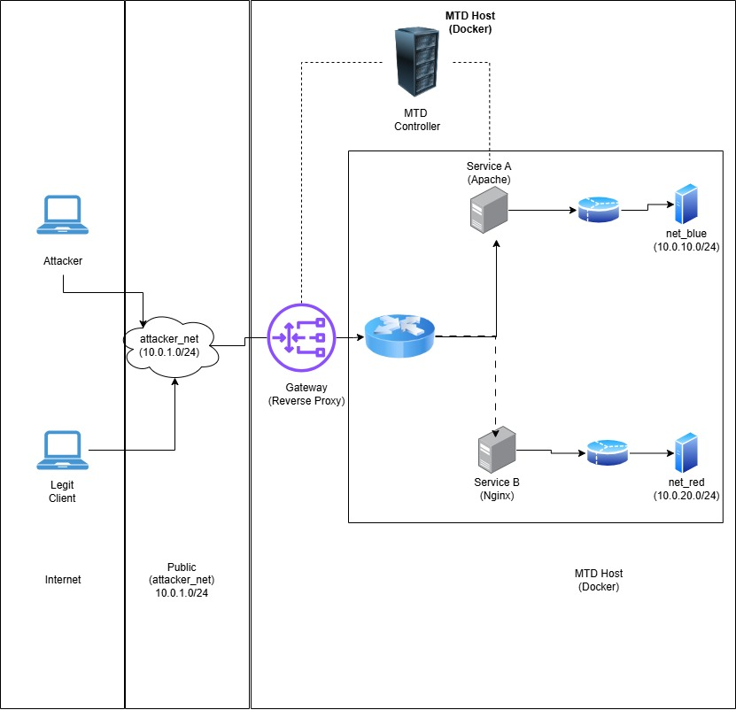

## Two Moving Target Defense (MTD) Techniques Implementation Plans.
## Name: Temitope James D.

### First Technique
Dynamic Network Topology (Subnet Shuffling)

### Concept:  
Instead of just shuffling IPs (NAS), this technique periodically changes network topology, which subnet a host belongs to or how routing paths are defined. It focuses on logical network reconfiguration rather than individual address changes.

### MITRE ATT&CK disruption:
Reconnaissance (T1595) — attacker’s network map becomes invalid.
Lateral Movement (T1021) — connections between nodes break when topology changes.

### Second Technique:
Dynamic Software Diversity (Service Rotation)

### Concept:  
Periodically change or randomize the software instance serving requests e.g., switching between two web servers (Apache ↔ Nginx) or different compiled binaries of the same app.

### MITRE ATT&CK disruption:
Exploitation (T1203) — attacker’s exploit payload fails because the target binary changes.
Persistence (T1547) — malware relying on static binaries or predictable paths loses access.

### Goal:
Show that both the network path and the software fingerprint of the protected service change over time, degrading attacker reconnaissance and exploit reliability.

### Detailed implementation plan
**Environment:** 
Containers (Docker) : It is easy to implement subnet and service rotation on a docker.

**Technique 1:** Dynamic Network Topology (subnet rotation)
**Create Docker networks:** I will need to create a docker network for attacker, client, gateway and also for internal service networks

**MTD Function:** I will need a script that will serve as MTD Controller, that every (T) seconds it will disconnect the active service container from one of the backend services to another. It will keep both containers but change which network the gateway uses as upstream.

### Technique 2: Dynamic Software Diversity (service rotation)
I will need to configure gateway reverse proxy using a small config template and reloading Nginx/HAProxy when the active backend changes.

## Testing plan
I will be testing it by running a single network on a fixed network with no MTD technique first. After the initial attack, I will take record of the open ports and service banners. Then I will start MTD Controller (network + software rotation). 

After performing repeated scans and request at different times, i will record how often the server banner changes (`Apache ↔ Nginx`). If there are any transient failures or timeouts, and also determine whether the attacker can build a stable profile of the target.

---

## Topology Description
The test environment will be built around a single MTD enabled host running Docker, where two complementary Moving Target Defense techniques operate simultaneously: Dynamic Network Topology and Dynamic Software Diversity. The attacker and a benign client both reside on an external network segment `attacker_net`, from which they interact with a reverse proxy gateway container exposed to the outside. 

Behind this gateway, two internal docker networks `(net_blue and net_red)` host the protected service containers. The MTD Controller, a lightweight automation component, periodically reassigns the active service container between these internal networks causing the internal routing path to shift over time. This implements the network level MTD: the service’s reachable topology changes without altering the external interface.

Simultaneously, the gateway forwards traffic to one of two backend service containers (Service‑A and Service‑B), each running a different software stack (e.g., `Apache vs. Nginx`). The MTD Controller alternates which backend is active, creating periodic software level diversity. From the attacker’s perspective, both the internal network location and the exposed software fingerprint change unpredictably, invalidating reconnaissance and reducing exploit reliability. This is a topology of an attacker and client on one network, a gateway in the middle, and two service containers behind it connected to two internal networks, with the MTD Controller orchestrating both rotations.
