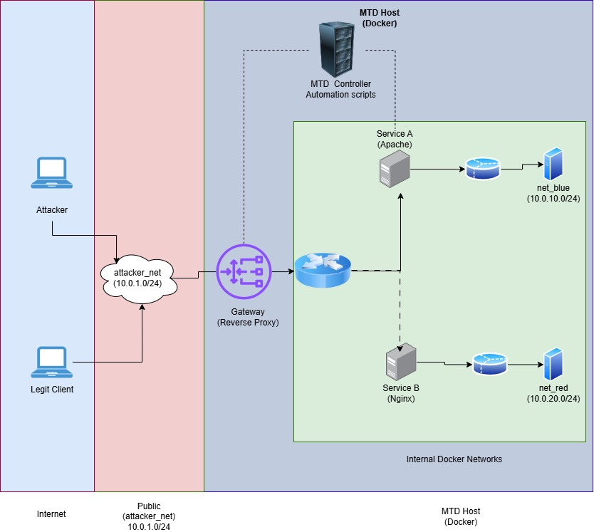

## Defense with many instances
## Name: Temitope James DADA.

### Whats the regular use of the techniques (the baseline)

- A small office hosting internal services behind a reverse proxy

- A cloud microservice cluster with dynamic routing and rolling updates

- A DevOps CI/CD environment where services are frequently redeployed

### The deployment environment ( office environment, microservice deployment ) 

The two techniques i will be working on (Dynamic Network Topology (Subnet Rotation), Dynamic Software Diversity (Service)) will be deployed in a microservice style architecture, simulating a small enterprise. 

- External users (attacker + legitimate client) access a stable gateway

- Internal services run on isolated overlay networks

**A lightweight MTD Controller automates both:**

- Network‑level changes (subnet rotation)

- Application‑level changes (software diversity)

**Updated topology**
