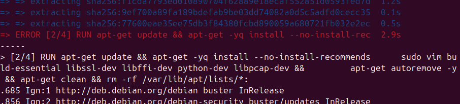
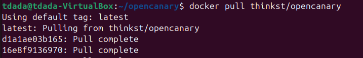
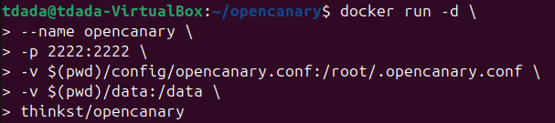
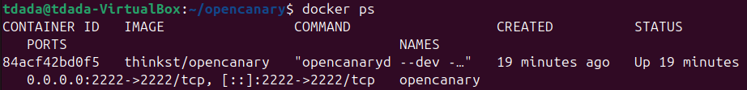
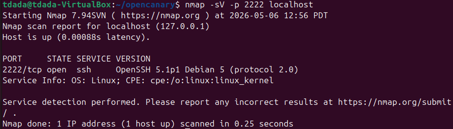
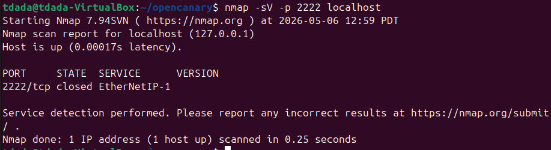

## Week 6 honeypots 
## Name: Temitope James D.

- i configure my git global username and email, then clone the opencanary github repo.

- i created a config file after cloning the repo. In the config file i turn on a service that is not on by default and i add port mapping when running the container 
  
```
{
    "device.node_id": "opencanary-1",
    "logger": {
        "class": "PyLogger",
        "kwargs": {
            "formatters": {
                "plain": {
                    "format": "%(message)s"
                }
            },
            "handlers": {
                "file": {
                    "class": "logging.FileHandler",
                    "filename": "/data/opencanary.log"
                }
            }
        }
    },
    "ssh.enabled": true,
    "ssh.port": 2222,
    "ftp.enabled": false,
    "http.enabled": false
}
```
- i ran `docker build -f Dockerfile.stable -t opencanary .` to build the stable version of the Dockerfile, but i encountered an error 


- so i decided to use the official prebuilt OpenCanary Docker image. i ran `docker pull thinkst/opencanary`


To run the container with my config file, i use this:
```
docker run -d \
  --name opencanary \
  -p 2222:2222 \
  -v $(pwd)/data/.opencanary.conf:/root/.opencanary.conf \
  -v $(pwd)/data:/data \
  thinkst/opencanary

```
- `-d` this is to run the operation in detached mode without output logs.
- `--name opencanary` is to name the container
- `-p 2222:2222` to map the host port to container port as it is required for SSH honeypot
- `-v $(pwd)/config/opencanary.conf:/root/.opencanary.conf` This was used to mount the config file into the container
- `-v $(pwd)/data:/data` this was used to mount the data directory to store logs persistently
-  `thinkst/opencanary` to specify the official image.


- To confirm that it is working i ran `docker ps`


- I install the nmap on my machine with `sudo apt-get install nmap`. then i verify the honeypot is running with `nmap -sV -p 2222 localhost` 


- Run nmap without the honeypot, i stop the opencanary with `docker stop opencanary` then run `nmap -sV -p 2222 localhost` again.


### Midterm progress:
I have completed the environment setup, core functionality, and abstract, leaving only the remaining aspects of the documentation to be refined.


### Reference 
- https://github.com/thinkst/opencanary/wiki/Using-Dockerised-OpenCanary#building-and-running-your-own-docker-opencanary-image-with-docker
- Google.com