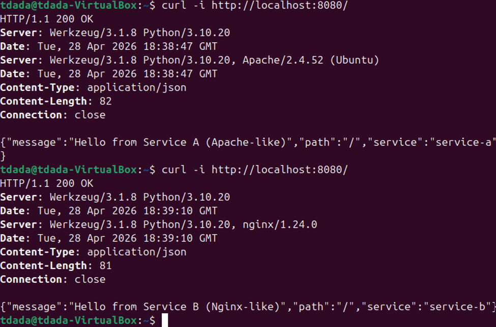
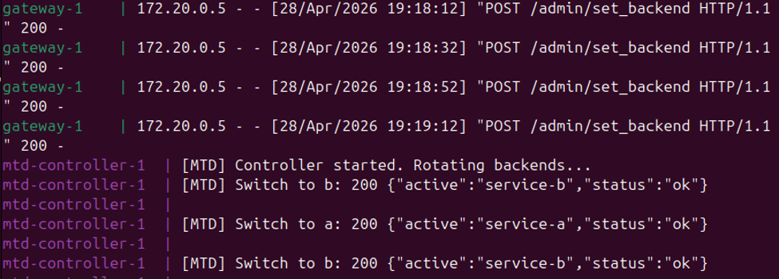

## Name: Temitope James D.
### Give me progress reports for your midterm.
**5 sentences.**
- I have completed most of the environment setup and the core functionality. 
- I have tested the feasible part of the hacker
- I am yet to verify the clients side of view
- I have written the Abstract
- Remaining work include refining the other aspect of the documentation

### Include what you were able to accomplish during class.

I did the testing of what the hacker will be experiencing and it proved that the services is changing and the network are switching also. I started working on getting a simple client web page that proves backend switching would not affect a legitimate users.