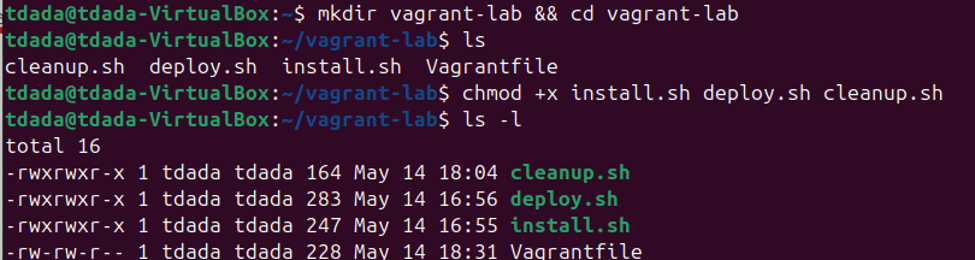
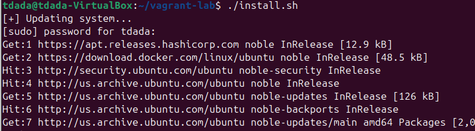
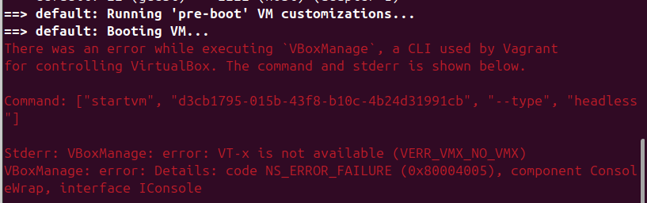
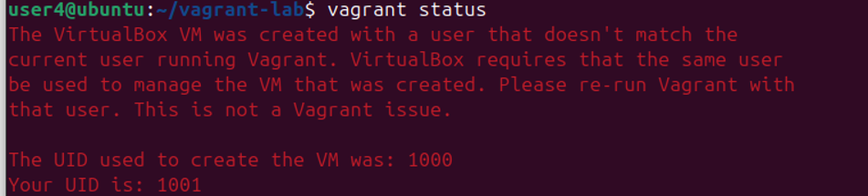
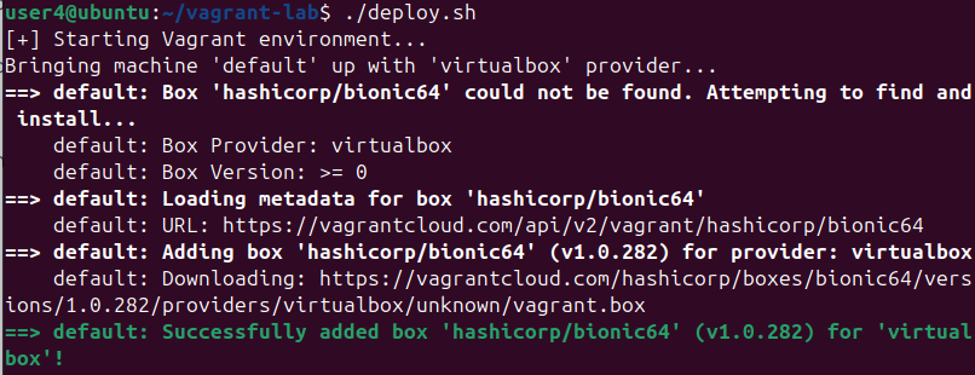
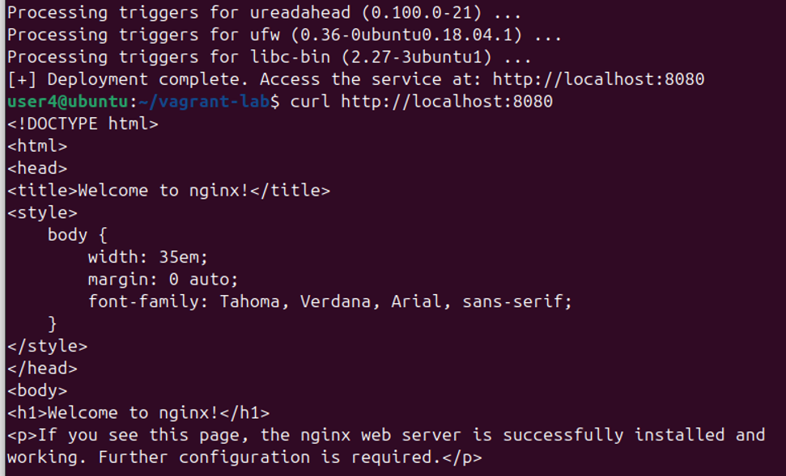
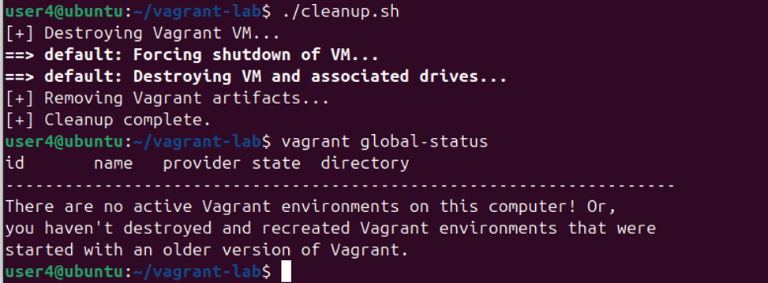

### Procedure and Challenges  
I set up the file directory and created the files needed for the project

Then i ran `./install` to install all the packages like the virtualbox and VM, needed for the orchestration environment to run.

After the successful installation i encountered an error when i ran `./deploy.sh` which shows that the VM host on my windows is not exposing the internal VM to windows virtualisation. 

Then i SSH into a server that supports the virtualisation. After ssh'ing into the school server that supports virtualization, I continued my work by running all these:

to copy my file from my machine to the server:
`scp -r ~/vagrant-lab user4@10.202.12.84:~`

then i change directory
cd ~/vagrant-lab
chmod +x *.sh
./install.sh
./deploy.sh

I experienced an error of user conflict after copying my files to the server because I have initiated vagrant before, and some residue data like the user ID (UID) of the former machine were still present. 

I used `rm -rf .vagrant`, `vagrant destroy -f` to delete the old VM metadata

Then I proceed to deploy with `./deploy.sh`. it checked for hashicorp/bionic64 box image, installed it, create and boot the VM in VirtualBox then SSH into the VM and install nginx.

I curl with `curl http://localhost:8080` to confirm its up and running 

I used ./cleanup.sh to  destroy the  vagrant and I confirm that with `vagrant global-status`

## Resources
- https://portal.cloud.hashicorp.com/vagrant/discoverLinks to an external site.

- https://developer.hashicorp.com/vagrant/docs/boxes

- https://spacelift.io/blog/infrastructure-as-code-tools

The read me file can be found 

