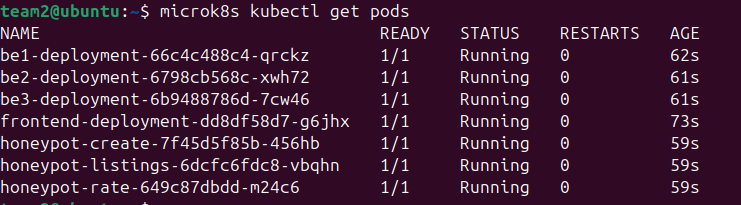

## Name: Temitope James DADA
## Today’s journal
1. Tell me how easy it was to re-deploy your lab 7 infrastructure.
Redeploying our entire Lab7 environment was a little bit easy and straightforward. The recovery process required two scripts(setup and deploy), from our project which we prepared ahead of time to mitigate any unforseen challenges.

2. Explain if this was the best way, or if there is a preparation you would have rather made.

The approach we took was okay, the scripts saved us the time of manually reinstalling dependencies, rebuild images, or reapply Kubernetes YAMLs during the recovery.

However, i see the need of including the right environment permission for the recovery which will aid the running of the scripts, into our README.md file. That will also help the process of recovery next time.

